# AI for Medical Diagnosis

# Week 1
---
## Medical Image Diagnosis:

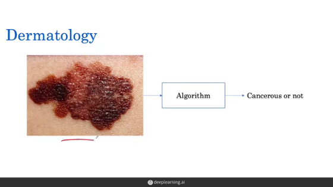</img>

Dermatology is the branch of medicine dealing with the skin. One of the task dermatologists perform is to look at a suspicious region of the skin to determine whether a mole is skin cancer or not.

Early detection could likely have an enormous impact on skin cancer outcomes. The five-year survival rate of one kind of skin cancer drops significantly if detected in its later stages.

In this study, an algorithm is trained to determine whether a region of skin tissue is cancerous or not. Using hundreds of thousands of images and labels as input, a convolutional neural network can be trained to do this task. 

It has been found that, given sufficient training data, we can train the classifiers to achieve an accuracy comparable to that of dermatologists.

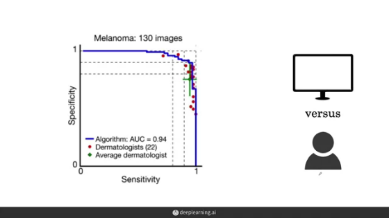</img>

## Eye Disease and Cancer Diagnosis:

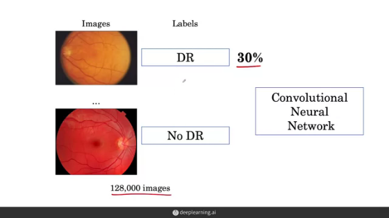

The field of Opthalmology deals with the diagnosis and treatment of eye disorders. One well-known study in 2016 looked at retinal fundus images, which photographed the back of the eye. One disease or pathology to look at here is diabetic retinopathy, which is damage to the retina caused by diabetes and is a major cause of blindness. Currently, detecting DR is a time-consuming and manual process that requires a trained clinician to examine these photos. 

This study used over 128,000 images of which only 30 percent had diabetic retinopathy. We'll look at this data imbalanced problem,
which is prominent in medicine and in many other fields with real-world data. 

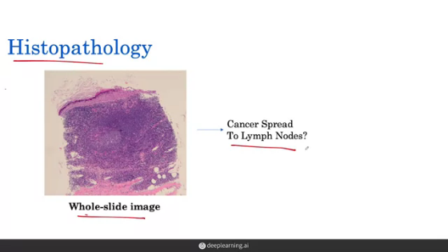

One of the tasks that pathologists do is look at scanned microscopic images of tissue called whole slide images, and determine the extent to which a cancer has spread. 

Now in histopathology, the images are very large and cannot
be fed directly into an algorithm without breaking them down.
The general setup of these studies is that instead of feeding in one large,  high resolution digital image of the slide, several patches are extracted at a high magnification and used to train a model. 

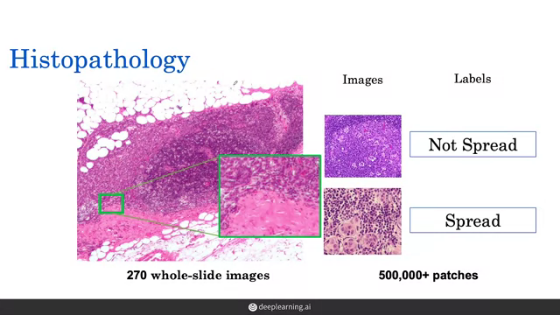

## How to handle class imbalance:

Chest X-ray interpretation is critical for the detection of many diseases, including pneumonia and lung cancer which affect millions of people worldwide each year. Now a radiologist who is trained in the interpretation of chest X-rays looks at the chest X-ray, looking at the lungs, the heart, and other regions to look for clues that might suggest if a patient has pneumonia or lung cancer or another condition. 

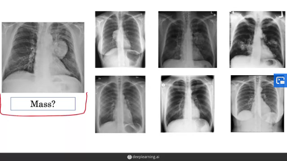

We humans can easily identify if a mass is present in the CXR or not. We need to implement algorithms which detect masses in the same way. A mass is defined as a lesion or in other words damage of tissue seen on a chest X-ray as greater than 3 centimeters in diameter.

## Training, prediction, and loss:

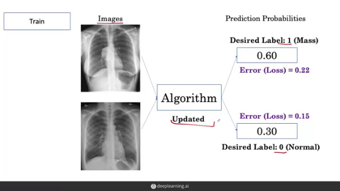

During training, the algorithm is shown two classes of CXR's : mass, no mass. The model infers rules for prediction using these scans. 

The algorithm produces an output in the form of scores, which are probabilities that the image contains a mass. So the probability that the first image contains a mass is outputted to be 0.60, and the probability for second image is outputted to be 0.30 which do not match the desired labels.

> 3 Key Challenges for medical image classification:
>   * Class Imbalance
>   * Multi-Task
>   * Dataset Size
---
**Class Imbalance:** There's not an equal number of examples of
non-disease and disease in medical datasets. This is a reflection of the prevalence or the frequency of disease in the real-world, where we see that there are a lot more examples of normals than of mass, especially if we're looking at X-rays of a healthy population

This creates a problem for the learning algorithm would seize mostly normal examples. This yields a model that starts to predict a very low probability of disease for everybody and won't be able to identify when an example has a disease. 

*Binary cross-entropy loss* : 

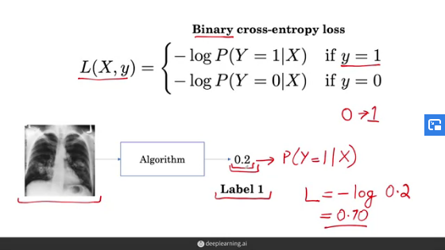

For the given example, if the algorithm predicts a probablity of 0.2 with given label 1. Now, the 0.2 here is the probability
according to the algorithm of Y being equal to 1, the probability that this example is a mass. So now, we can apply
the loss function to compute the loss on this example. 

Our loss is negative log and then we're going to take the algorithm output, 0.2. So this evaluates to 0.70.

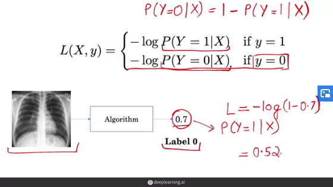

In this non-mass example, the output probability is 0.7. But as the label is 0, we need to calculate the probability of Y=0 given input image, which is obtained by subtracting the probability from 1. So the algorithm says 70 percent probability that something is mass, then there's 30 percent probability it's not. So here we're going to plug in 1 minus 0.7, that's going to come out to 0.3 and this expression evaluates to 0.52. 

### Impact of class imbalance on loss calculation:

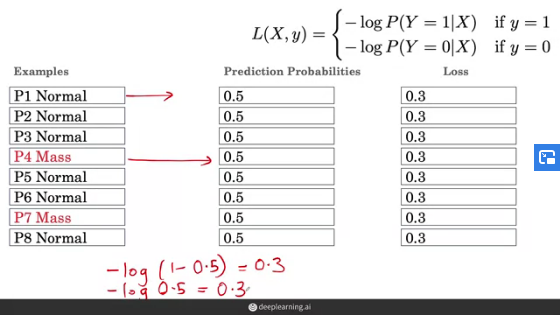

In the above example, we have 10 examples where only 2 images contain a mass. For a normal example, we're going to use negative log of 1 minus 0.5, which is going to come out to 0.3. For a mass example, we're going to use negative log of 0.5,
which is also going to come out to 0.3. 

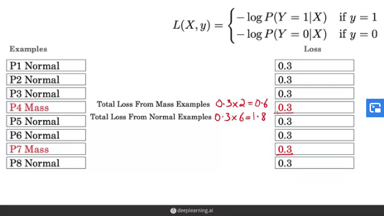

The total contribution to the loss from the mass examples,
comes out to 0.3 times 2, which is **0.6**. While the total loss from the normal example, comes out to 0.3 times the
6 normal examples, which is **1.8**.

So, most of loss is coming from the normal examples. So the algorithm is optimizing its updates to get the normal examples,
and not giving much relative weight to the mass examples. This doesn't create an unbiased classifier and is what we refer to as the **class-imbalance problem**.

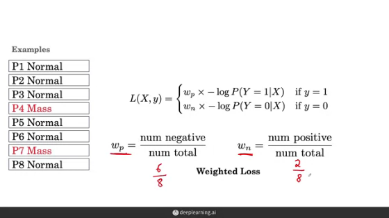

To counteract this problem, we multiply the loss functions with weight factors. In the general case, the weight we'll put on the positive class will be the number of negative examples over the total number of examples and vice versa. 

Applying the new loss functions on the dataset, we can see that are new losses from each class are balanced.

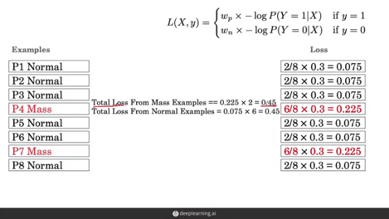

### Resampling to achieve balanced class:

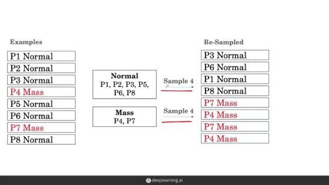

The basic idea here is to re-sample the dataset such that we have an equal number of normal and mass examples. This might mean that we may not use all of the examples from the normal group and more than one copy of the mass examples. 

The loss contributed by each class is also same when we use this method. Other techniques include **undersampling the normal class**, or **oversampling the mass class** to combat the data imbalance problem.

--- 

**Multi-Task:** Instead of training to detect only one specified disease, we need to train our algorithms to detect the absence or presence of many such diseases. This is the multitask challenge. Now, one simple way to do this, is to have models that each learn one of these tasks. 

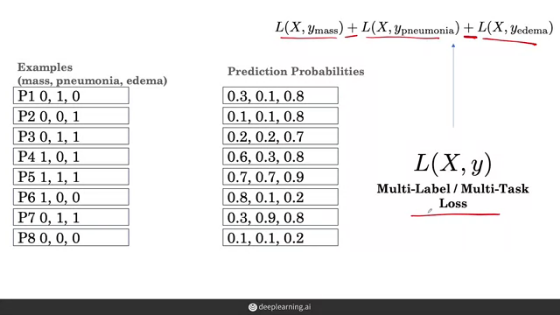

So instead of the examples having one label, they now have one label for every disease in the example where zero denotes the absence of that disease and one denotes the presence of that disease. For the first one, we have an absence of mass, a presence of pneumonia and an absence of another disease, edema, which is excess fluid in the lungs. Instead of having one output from the model, the model now has three different outputs denoting the probability of the three different diseases.

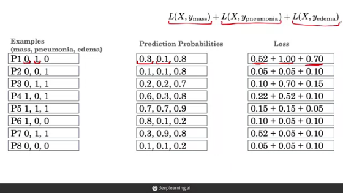

To calculate the total loss for each individual example, we add up the three losses given to us by the individual loss function components. 

> **NOTE: In the first example, the loss of the mass example, shouldn't be 0.52. This is a miscalculation and should be -log(0.7) = 0.15 instead.**

One final consideration is how we can account for class imbalance in the multitask setting. This time, we not only have a weight associated with just the positive and the negative labels, but it's for the positive label associated with that particular class and the negative label associated with
that particular tasks such that for mass, there will be a different way to the positive class than to pneumonia or to edema.

---

**Dataset Size**: For many medical imaging problems, the architecture of choice is the convolutional neural network,
also called a ConvNet or CNN. These are designed to process 2D images like x-rays. 

Inception, ResNet, DenseNet, ResNeXt and EfficientNets have been proposed and are widely popular in image classification. These architectures are composed of various building blocks. In medical problems, the standard is to try out multiple models on the desired tasks and see which ones work best. 

The challenge is that all of these architectures are data hungry and benefit from the millions of examples found in image classification datasets. One solution, is to pre-train the network. Here the idea is to first have the network, look at natural images, and learn to identify objects such as penguins, or cats, or dogs, then use this network as a starting point for learning in medical imaging task by copying over the learned features. 

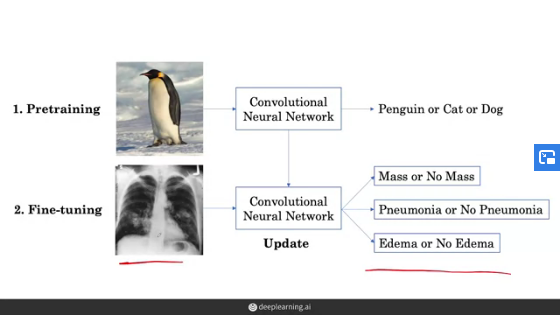

The idea of this process, is that when we're learning our first task of identifying cats or dogs, the network will learn general features that will help it's learning on the medical task. An example of this, might be that the features that are useful to identify the edges on a penguin, are also useful for identifying edges on a lung, which are then helpful to identify certain diseases. Then when we transfer these features to our new network, the network can learn the new task of chest X-ray interpretation with a better starting point.

This is referred to as **transfer-learning** and is widely used to learn low-level image features that are broadly generalizable. So when we fine-tune the network on chest X-rays, instead of fine-tuning all features we've transferred, we can freeze the features learned by the shallow layers and just fine-tune the deeper layers. 

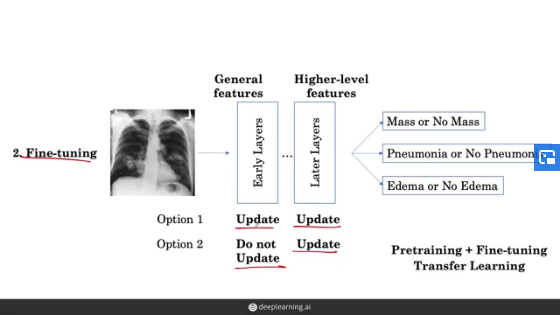

### Generating More Samples:

**Data Augmentations:** The idea is to trick the network into thinking that we have more training examples that are disposal than we actually do. 

In practice, there are two questions that drive the choice of transformations we pick:
* The first is whether we believe the transformation reflects variations that will help the model generalize the test set and therefore the real world scenarios.For instance, we might believe that we're likely to see variations in contrast in natural X-rays, so we might have a transformation that changes the contrast of an image. 
* A second design choice is to verify that our transformation keeps the label the same. For instance, if we're laterally inverting a patient's X-ray, this means flipping the left over to
the right and the right over to the left, then their heart would
appear on the left-hand side of the image. This is the right of the body. However, the label of normal would no longer hold because this is actually a **rare heart condition called dextrocardia** in which your heart points to the right side of your chest instead of to the left side. So this is not a transformation that preserves the label. 

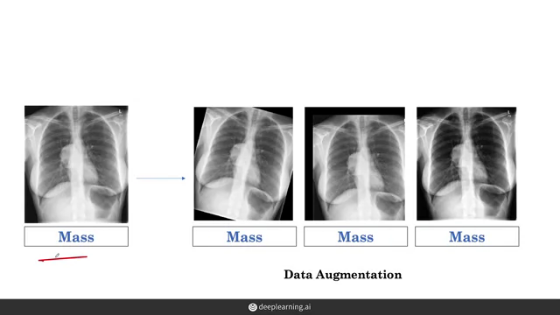

---

## Model Testing: 

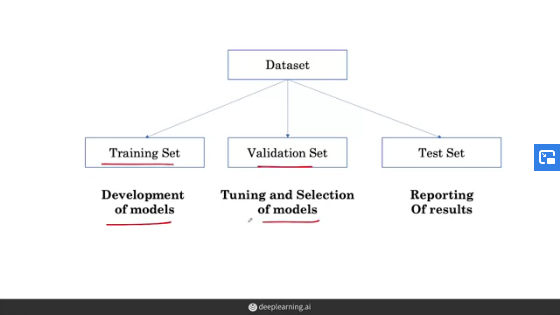

When we apply machine learning algorithms to a dataset, we usually split it into a training and a test set. Our training set is used for the development and selection of models and our test set for the final reporting of our results. The training dataset is further split into a training set and a validation set, where the training set is used to learn a model and the validation set is used for hyper parameter tuning and giving an estimate of the model performance on the test set. 

> We'll cover three challenges with building these sets in the context of medicine. The first challenge relates to how we make these test sets independent, the second relates to how we sample them, and the third relates to how we set the ground truth. 

---
**1)** Deep learning models can unintentionally memorize training data, and the model could memorize rare or unique training data aspects of the patient. This would lead to an overly optimistic test set performance, where we would think that our model is better than it actually is. 

* Split by patient: When we split a data set in the traditional way, images are randomly assigned to one of the sets. Notice that this way we get X-rays that belong to the same patient in different sets. Instead, when we split a dataset by patient, all of the X-rays that belong to the same patient are in the same set.

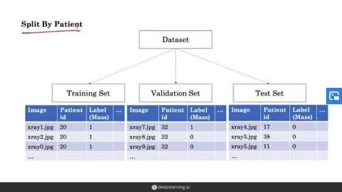

---
**2)** The challenge with sampling a test set is that when we're randomly sampling a test set of hundreds of examples from the dataset, we might not sample any patients that actually have a disease. Here, we might not sample any examples where the label for mass is 1. Thus, we would have no way to actually test the performance of the model on these positive cases.

One way that this is tackled when creating test sets is to sample a test set such that we have at least X% of examples of our minority class. Here, the minority class is simply the class for which we have few examples like here examples where mass is present. 

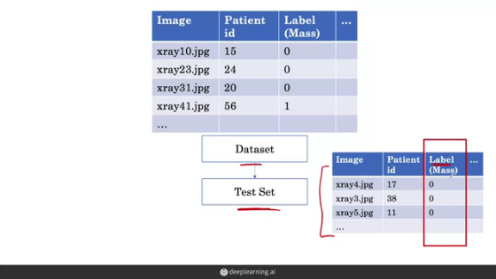

Because the test and validation set have been artificially sampled to have a large fraction of mass examples, the training set will have a much smaller fraction of mass examples. 

---
**3)** To determine the correct label for an example, we can use the consensus voting method. The idea behind consensus voting is to use a group of human experts to determine the ground truth. In general, the answer will be the majority vote of the three experts. 

The second method is to use a more definitive test which provides
additional information to set the ground truth. For example, to determine whether a patient has a mass using a chest x-ray, a more definitive test that can be performed is a CT scan. 

With the second method, the difficulty is that we might not have these additional tests available. Not everyone who gets a chest x-ray gets a CT scan, and not everyone who has a potentially suspicious skin lesion gets a biopsy. Thus having a reliable ground truth with an existing data set often has to use the first method of getting a consensus ground truth on the existing data, which is the strategy that many medical AI studies use.