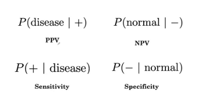

# AI for Medical Diagnosis

# Week 2
---
## Key evaluation metrics:

When computing the accuracy on a test set, we look at the proportion of the total examples that the model correctly classified. 

**Accuracy = P(+|disease)P(disease) + P(-|normal)P(normal)**

Using the law of conditional probability we can expand the definition of accuracy. The first term in the above equation is the probablity that we predict positive given a patient has a disease. Similarly the second term denotes the probability of predicting negative given a patient is normal.

</img>

**Sensitivity:** If a patient has the disease, what is the probability that the model predicts positive?

**Specificity:** If a patient is normal, what is the probability that the model predicts negative?

The probability of a patient having disease in a population is called the prevalence. 

**Accuracy = Sensitivity * Prevalence + Specificity * (1-Prevalence)**

</img>

**Positive Predictive Value:** If the model predicts positive on a patient, what is the probability that they actually have the disease?

**Negative Predictive Value:** If the model predicts negative on a patient, what is the probability that a patient is normal?

</img>

</img>

## Confusion Matrix:

</img>

In some studies, you may have to compute the Positive predictive value (PPV) from the sensitivity, specificity and prevalence.

**Rewriting PPV:**

PPV=P(pos|pos^).

(pos is "actually positive" and pos^ is "predicted positive")

By Bayes rule, this is:

PPV=(P(pos^|pos)×P(pos))/P(pos^)

**For the numerator:**

Sensitivity=P(pos^|pos)

Recall that sensitivity is how well the model predicts actual positive cases as positive.

Prevalence=P(pos) 

Recall that prevalence is how many actual positives there are in the population.

**For the denominator:**

P(pos^)=TruePos+FalsePos

In other words, the model's positive predictions are the sum of when it correctly predicts positive and incorrectly predicts positive.

The true positives can be written in terms of sensitivity and prevalence.

TruePos=P(pos^|pos)×P(pos), and you can use substitution to get

TruePos = Sensitivity × Prevalence

The false positives can also be written in terms of specificity and prevalence:

FalsePos = P(pos^|neg)×P(neg)

1−specificity = P(pos^|neg)

1−prevalence = P(neg)

**PPV rewritten:**

If you substitute these into the PPV equation, you'll get

PPV = (sensitivity × prevalence)/((sensitivity × prevalence)+(1−specificity)×(1−prevalence))

## ROC Curve and Threshold:

Our choice of threshold affects the metrics we have looked at thus far. Here disease is red and normal is blue. We can pick a threshold small t, that sets everything on the right of the threshold as we classify positive and everything on the left of the threshold, we classify as negative. 

</img>

## Confidence Intervals:

Confidence intervals allow us to say that using our sample, we're 95 percent confident that the population accuracy p is in the interval [0.72, 0.88].  0.72 is called the lower bound and 0.88, the upper bound of this interval.

</img>

For each of these samples, we can plot the sample accuracies, here represented by the circle, and the lower and upper bounds of the confidence intervals of the samples. On this plot, we also have the true population accuracy plotted as the dotted line.

Note that most of these samples contain the population accuracy, this vertical line. Here, six out of the seven contain it and one misses it. In fact, when we have 95 percent confidence intervals, 95 percent of the samples will contain the population accuracy. Ninety-five percent is what's called our confidence level. Thus, the interpretation of 95 percent confidence is that in repeated sampling, this method produces intervals that include the population accuracy in about 95 percent of samples. 

One of the factors that affects the width of the confidence intervals, which is given by how close these numbers are, is the sample size. To summarize, confidence intervals are useful because even when we cannot run the model on a whole population,
we can at least use a test result on a sample to express the range in which we're pretty sure our population accuracy lies. 

Precision-Recall is a useful measure of success of prediction when the classes are very imbalanced.

In information retrieval:

    Precision is a measure of result relevancy and that is equivalent to our previously defined PPV.
    Recall is a measure of how many truly relevant results are returned and that is equivalent to our previously defined sensitivity measure.

The precision-recall curve (PRC) shows the trade-off between precision and recall for different thresholds. A high area under the curve represents both high recall and high precision, where high precision relates to a low false positive rate, and high recall relates to a low false negative rate. 

F1 score is the harmonic mean of the precision and recall, where an F1 score reaches its best value at 1 (perfect precision and recall) and worst at 0. 