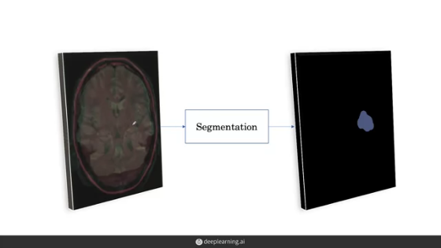

# AI for Medical Diagnosis

# Week 3
---
## Medical Image Segmentation

Classification only tells us if an image has a disease or not. Segmentation outlines the parts of the image containing the disease. 

## MRI Data and Image Registration
</img>

MRI images are not just a single 2D image like X-rays, and MRI sequence is a 3D volume here seen in the axial view. Furthermore, an MRI example will be made up of multiple sequences, and this will consist of multiple 3D volumes. 

The key idea that we will use to combine the information from different sequences is to treat them as different channels. We can say one of the channels is red, one is green, and one is a blue channel in the same way that we have three channels of an RGB image. Once each sequence is represented with the different channel, what we do now is combine the sequences together to produce one image, which is the combination of all of the sequences. To us, this is now an RGB image. To the machine, these are channels stacked in the depth dimension. 

One challenge with combining these sequences is that they may
not be aligned with each other. For instance, if a patient moves
between the acquiring of each of these sequences, their head might be tilted in one sequence compared with the others. If the images are not aligned with each other when we combine them, the brain region at one location in the red channel does not correspond to the same location in the green or the blue channels. 

</img>

A preprocessing approach that's often used to fix this is called image registration. The basic idea with image registration, is to transform the images so that they're aligned or registered to each other. 

## Segmentation

</img>

Segmentation is the process of defining the boundaries of various tissues. In this case, we're trying to define the boundaries of tumors. We can also think of segmentation as the task of determining the class of every point in the 3D volume. These points in 2D space are called pixels and in 3D space are called **voxels.**

* 2D Approach: We break up the 3D MRI volume we've built into many 2D slices. Each one of these slices is passed into a segmentation model which outputs the segmentation for that slice.
One by one, each slice is passed through the segmentation model in this manner to generate a segmentation for every slice. The 2D slices can then be combined once again to form the 3D output
volume of the segmentation. 
  > The drawback with this 2D approach is that we might lose important 3D context when using this approach. For instance, if there is a tumor in one slice, there is likely to be a tumor in the slices right adjacent to it. Since we're passing in slices one at a time into the network, the network is not able to learn this useful context.

</img>

* 3D Approach: In the 3D approach, ideally, we'd want to pass in the whole MRI volume into the segmentation model and get out a 3D segmentation map for the whole MRI. However, the size of the MRI volume makes it impossible to pass it in all at once into the model. 
In the 3D approach we break up the 3D MRI volume into many 3D sub volumes. Each of these sub volumes has some width, height, and depth context. So like in the 2D approach, we can feed in the sub volumes now one at a time into the model and then aggregate them at the end to form a segmentation map for the whole volume. 
    > The disadvantage with this 3D approach is that we might still lose important spatial context. For instance, if there is a tumor in one sub volume, there is likely to be a tumor in the sub volumes around it too. Since we're passing in sub volumes one at a time into the network, the network will not be able to learn this possibly useful context. 

</img>

## 2D and 3D U-Net

</img>

The U-Net was first designed for biomedical image segmentation and demonstrated great results on the task of cell tracking. The cool thing about the U-Net, is that it can achieve relatively good results, even with hundreds of examples. 

**2D**

The U-Net architecture owes its name to a U-like shape. The U-Net consists of two paths: a contracting path, and an expanding path.
 * The contracting path is a typical convolutional network like used in image classification. It consists of repeated application of convolution and pooling operations. The convolution operation here is called a down convolution. The key here, is that in the contracting path, our feature maps gets spatially smaller, which is why it's called a contraction. 
 * The expanding path in some ways is doing the opposite of the contracting path. It's taking our small feature maps through a series of up-sampling and up-convolution steps to get back to the original size of the image. It also concatenates the up-sample representations at each step with the corresponding feature maps at the contraction pathway. Finally, at the last step, the architecture outputs the probability of tumor for every pixel in the image. 

**3D**

</img>

We can feed any 3D subvolume into a segmentation architecture,
if we can replace all of the 2D operations with their 3D counterparts. This is exactly what an extension to the U-Net called the 3D U-Net does. The 2D convolutions become 3D convolutions, and the 2D pooling layers become 3D pooling layers. 

The 3D U-Net allows us to pass in 3D subvolumes and get an output for every voxel in the volume specifying the probability of tumor. The 3D U-Net can be trained on subvolume input and outputs as part of the 3D approach. 

## Data Augmentation

One key difference with data augmentation during segmentation
is we now have a segmentation output. So when we rotate an input image by 90 degrees to produce a transformed input. We also need to rotate the output segmentations by 90 degrees to get our transformed output segmentation. The second difference is that we now have 3D volumes instead of 2D images. So the transformations have to apply to the whole 3D volume. 

</img>

Here, P represents the output of the segmentation model on 9 pixels. Where at each location, we have the predicted probability of tumor. G specifies the ground truth on each of these pixel locations. Three of the nine pixels are tumor represented as 1, and the remaining six are normal brain tissue represented as 0. 

</img>

## Loss function for image segmentation

</img>

We'll use the **soft dice loss** to optimize the segmentation model.
The soft dice loss is a popular loss function for segmentation models. The advantage of the soft dice loss is that it **works well in the presence of imbalanced data.** This is especially important in our task of brain tumor segmentation, when a very small fraction of the brain will be tumor regions.

The soft dice loss will measure the error between our prediction map, P, and our ground truth map, G. We take 1 minus this fraction, such that a higher loss corresponds to a small overlap and a low loss corresponds to a high overlap. 

The model optimizes this loss function to get better and better segmentations.

## Different Populations

One of the main challenges with applying AI algorithms in the clinic, is achieving reliable generalization. Generalization can be hard due to a variety of reasons. 

## External Validation

To be able to measure the generalization of a model on a population that it hasn't seen, we want to be able to evaluate on a test set from the new population. This is called external validation. External validation can be contrasted with internal validation, when the test set is drawn from the same distribution as the training set for the model. 

And if we find that we're not generalizing to the new population,
then we could get a few more samples from the new population to create a small training and validation set and then fine-tune the model on this new data. 

</img>

All of these studies that we've talked about worked with retrospective data, meaning that they used historically labeled data to train and test algorithms. However, to understand the utility of AI model s in the real-world, they need to be applied to real-world data or prospective data. 

One reason for this is that with retrospective data, there are often steps taken to process and clean the data, but in the real-world, the model has to work with the raw data. 

As a concrete example of this, the data set you've trained your model on has been filtered to only include frontal x-rays, where the x-ray is taken from the front or the back of the patient. However, in the real-world, it is also common to take a fraction of the x-rays from the side of the patient. These are called lateral x-rays.

## Measuring Patient Outcomes

Another challenge for the real-world deployment of AI models is
that we need metrics to reflect clinical application. We've seen some ways of evaluating models we've built, which included looking at the area under the AUROC curve or looking at the dice score. 

</img>

Another approach is to see what happens in the setting of a randomized control trial where we compare patient outcomes for patients on whom the AI algorithm is applied versus those on whom the AI algorithm is not applied. In the real world, we would want to analyze the effect of the model not just overall, but also on subgroups of the population. This would include patients of different ages, sex, and socioeconomic status. 

This allows us to find key algorithmic blind spots or unintended biases. For example, skin cancer classifiers that can achieve a performance level comparable to dermatologists when used on light skin patients have previously underperformed on images of darker skin tones. Algorithmic bias is an important and open area of research. 

A prospective study is the application of a model to data that is not historical.