# Introduction to Deep Learning

- [Introduction to Deep Learning](#introduction-to-deep-learning)
  - [Week 1](#week-1)
    - [Linear Regression](#linear-regression)
    - [Linear classification](#linear-classification)
    - [Gradient descent](#gradient-descent)

---

## Week 1

The course provides the basic building blocks which we'll use throughout our specialization.

We are expected to have basic knowledge of:
* Machine Learning
* Probability theory
* Linear algebra and Calculus
* Python programming

### Linear Regression

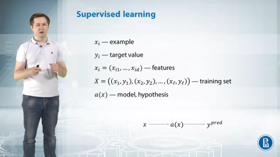

An image or any other object that we try to analyze in machine learning is called an example. And if it's an example that we try and model, it's a training example. 

We describe each example with deep characteristics that we call features. 

We have a grand truth and answer for each example. For example, in the problem of count in sea lions, we have a number of sea lions for every example, for every image. 

We denote this target values by *y*. So for example, *xi*, the target value is *yi*. 

Finally, we want to find a model, a function that maps examples to target values. We denote the function/hypothesis by a(x) and the goal of machine learning is to find a model that fits the training set *x* in the best way. 

Two main classifications in supervised learning problems:
* **Regression:** Target value is a real value (most of the times, natural numbers)
* **Classification:** Target values are finite. Assign input values to different classes/target values

**Linear model for regression**

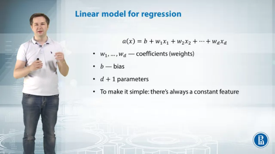

This is a linear model. It has **d+1** parameters where *d* is the *number of features* in our dataset. There are *d* weights or coefficients and one bias term, *b.*

It's a very simple model. Because for example, neural networks have much more parameters for the same number of features. And to make it even simpler, we'll suppose that in every sample, there is a fake feature that will always have a value of one.

So, a coefficient with this feature is the bias. We suppose it is among the weights.

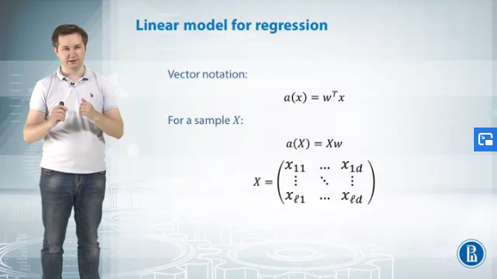

To write our linear model in vector form, we take the dot product of weight vector and feature vector X. 

In the matrix X, **rows represent training examples and columns represent features.** Then, to apply our model to this training set, we multiply matrix X by vector w and that's our predictions. 

**Loss function**

Loss functions are used as a metric to measure the quality of the model on the dataset.

One of the most popular choices for loss function in regression is **mean squared error**. 

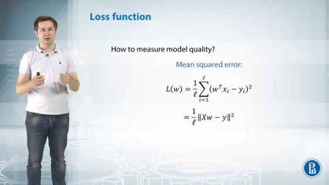

To calculate MSE:
* Calculate model prediction on a particular training example *xi* by taking the dot product of the weight vector *w* and training example
* Now subtract the prediction value from the ground truth to get the deviation of target value from predictive value
* Then we take a square of it and then we average these squares of deviations over all our training set. This is mean squared error. 

The lower the value of MSE, the better the model fits the data. 

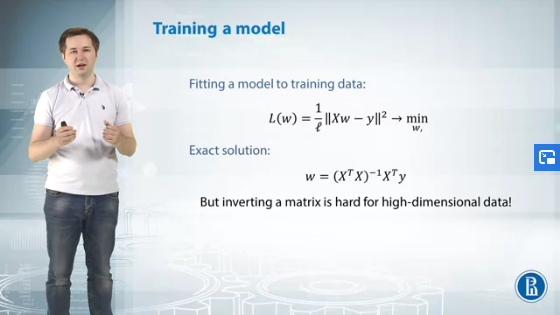

We try to optimize the loss to find the best model by minimizing it with respect to *w.*

Actually, if you do some calculus, if you take derivatives and solve the equations, then you'll have the analytical solution for these optimization problems. It goes like this, but it involves inverting and matrix. It is a very complicated operation. And if you have more than 100 or 1,000 features,
then it's very hard to find an inverse matrix for *XT* by *X.*

---

### Linear classification

In binary classification, we have two target values represented by -1 (negative class) and 1 (positive class). 

The linear model calculates the dot product between *w*,
weight vector, and *x*, feature vector. And to transform to either of the two values, we calculate the **sine of w transposed by X.**

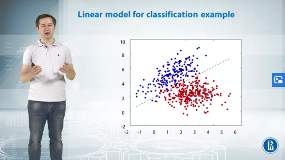

A linear classification model tries to find a line that separates two classes.

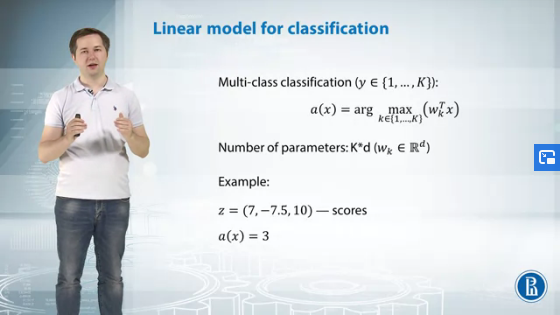

**Multi-class classification:**

One of the most popular approaches is to build a separate classifier for each class. So, for example, for the first class,
we'll have a linear model -- linear classifier -- that separates points of the first class from all other points.

So essentially, we try to fit a model so that points of the first class lie on the positive side of this line of this hyperplane, and points from all other classes lie on the negative side of this hyperplane. 

And the dot product of this model is essentially a score.
The higher the score, the more the model is confident that this point lies in the first class. 

Then we build such a model for every class, and we have K linear models, and each model calculates a score, and then we assign our new example to the class that has the largest score -- the class with higher confidence.

Classification accuracy is just a ratio of correctly classifying points in our training set. But this metric has two disadvantages:
* We need a gradient to optimize our loss function effectively.
And accuracy doesn't have gradients with respect to model parameters. So we cannot optimize it -- we cannot learn the model to accuracy score. 
* Model doesn't take into account the confidence of our model in this prediction. 

**Classification Loss:**

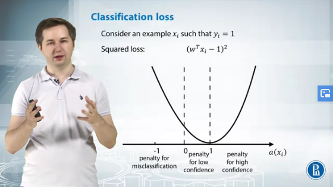

While using MSE as the loss function we can define three possible scenarios as given on the slide. 

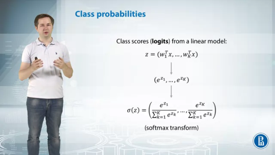

We need a way to convert our scores from linear classifiers,
to probabilities, to distribution. We have some vector of scores z, which has components w transposed by x, though these are scores for each of our classes. 

We use a softmax transform to convert the class scores from a linear model to probabilities. 

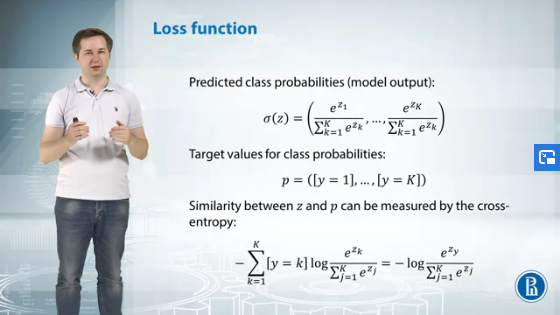

We have target vector *b*, vector of predicted class probabilities sigma of *z*, and we should somehow measure the distance between these probability distributions.

To do it, we can use **cross entropy.** Essentially, cross entropy is just a minus log of the predicted class probability for the true class. And also, we can write it as a minus sum of the indicator that our class *y* equals to K multiplied by log of the predicted class probability for the class K

Cross entropy gives a very high penalty for models that are confident in wrong decisions. Now we can just sum cross entropies over all examples from our training set, and that would be our loss function. 

---

### Gradient descent

Now that we have a loss function, we need some generic method that can take any differentiable loss function and find its minimum. And this method is gradient descent.

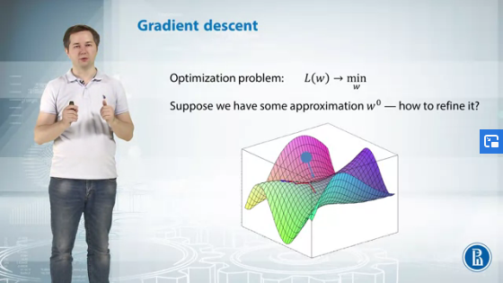

Let's take some initialization *w_zero*. It's just some point on our surface. And of course the surface of our function can be very difficult. It can have multiple minima, maxima, like for example on this graph. And we want to find some local minimum of our function. 

We should somehow find a way, find a direction where the function decreases in this point, and take a step in this direction.

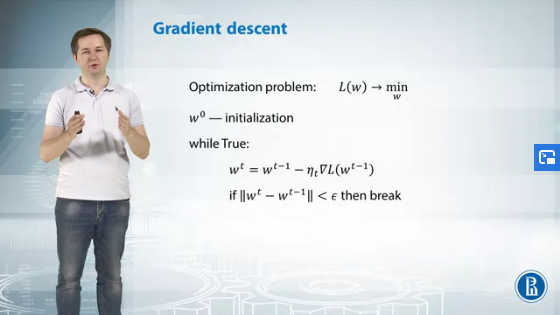

If we want to minimize our function, to minimize the value of *loss* and *w_zero*, we should just calculate gradient at the point *w_zero* and step in the direction of anti-gradient, of minus gradient.

We initialize our parameters by w_zero and on each step, we calculate the gradient and take a step in the anti-gradient at this point, and then we check some stopping criteria.

So, for example, if w_t, the parameter vector at this step is very close to w_t minus one, does it previous parameters, then we stop because it looks like we've achieved some minimum. 

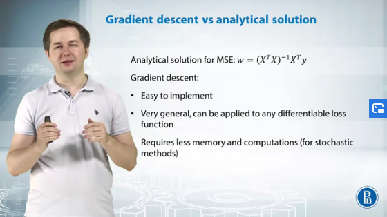
