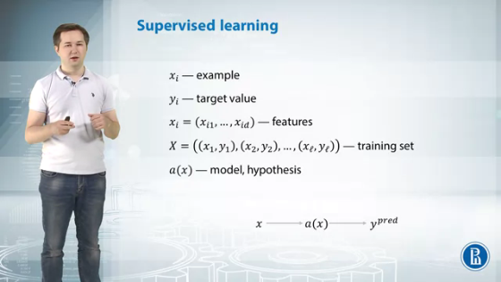
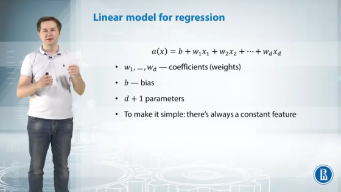
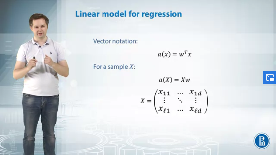
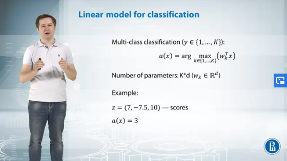
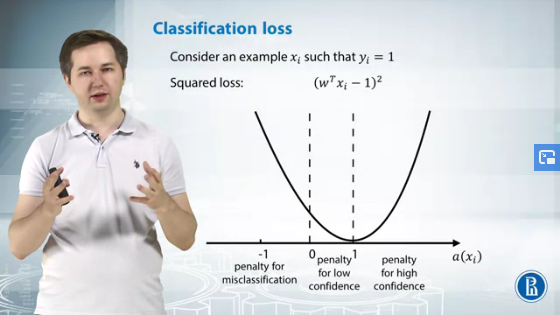
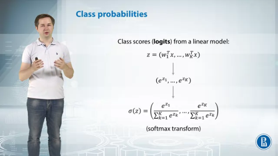
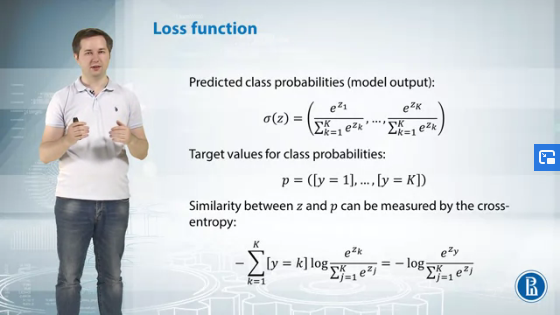

# Introduction to Deep Learning

- [Introduction to Deep Learning](#introduction-to-deep-learning)
  - [Week 1](#week-1)
    - [Linear Regression](#linear-regression)
    - [Linear classification](#linear-classification)
    - [Gradient descent](#gradient-descent)
    - [Overfitting Problem](#overfitting-problem)
    - [Model regularization](#model-regularization)
    - [Stochastic gradient descent](#stochastic-gradient-descent)
    - [Gradient descent extensions](#gradient-descent-extensions)

---

## Week 1

The course provides the basic building blocks which we'll use throughout our specialization.

We are expected to have basic knowledge of:
* Machine Learning
* Probability theory
* Linear algebra and Calculus
* Python programming

### Linear Regression

An image or any other object that we try to analyze in machine learning is called an example. And if it's an example that we try and model, it's a training example. 

We describe each example with characteristics that we call features. 

We have a ground truth and answer for each example. For example, in the problem of count in sea lions, we have a number of sea lions for every example, for every image. 

We denote this target values by *y*. So for example, *xi*, the target value is *yi*. 

Finally, we want to find a model, a function that maps examples to target values. We denote the function/hypothesis by a(x) and the goal of machine learning is to find a model that fits the training set *x* in the best way. 

Two main classifications in supervised learning problems:
* **Regression:** Target value is a real value (most of the times, natural numbers)
* **Classification:** Target values are finite. Assign input values to different classes/target values

**Linear model for regression**

This is a linear model. It has **d+1** parameters where *d* is the *number of features* in our dataset. There are *d* weights or coefficients and one bias term, *b.*

It's a very simple model. Because for example, neural networks have much more parameters for the same number of features. And to make it even simpler, we'll suppose that in every sample, there is a fake feature that will always have a value of one.

So, a coefficient with this feature is the bias. We suppose it is among the weights.

To write our linear model in vector form, we take the dot product of weight vector and feature vector X. 

In the matrix X, **rows represent training examples and columns represent features.** Then, to apply our model to this training set, we multiply matrix X by vector w and that's our predictions. 

**Loss function**

Loss functions are used as a metric to measure the quality of the model on the dataset.

One of the most popular choices for loss function in regression is **mean squared error**. 

To calculate MSE:
* Calculate model prediction on a particular training example *xi* by taking the dot product of the weight vector *w* and training example
* Now subtract the prediction value from the ground truth to get the deviation of target value from predictive value
* Then we take a square of it and then we average these squares of deviations over all our training set. This is mean squared error. 

The lower the value of MSE, the better the model fits the data. 

We try to optimize the loss to find the best model by minimizing it with respect to *w.*

Actually, if you do some calculus, if you take derivatives and solve the equations, then you'll have the analytical solution for these optimization problems. It goes like this, but it involves inverting and matrix. It is a very complicated operation. And if you have more than 100 or 1,000 features,
then it's very hard to find an inverse matrix for *XT* by *X.*

---

### Linear classification

In binary classification, we have two target values represented by -1 (negative class) and 1 (positive class). 

The linear model calculates the dot product between *w*,
weight vector, and *x*, feature vector. And to transform to either of the two values, we calculate the **sine of w transposed by X.**

A linear classification model tries to find a line that separates two classes.

**Multi-class classification:**

One of the most popular approaches is to build a separate classifier for each class. So, for example, for the first class,
we'll have a linear model -- linear classifier -- that separates points of the first class from all other points.

So essentially, we try to fit a model so that points of the first class lie on the positive side of this line of this hyperplane, and points from all other classes lie on the negative side of this hyperplane. 

And the dot product of this model is essentially a score.
The higher the score, the more the model is confident that this point lies in the first class. 

Then we build such a model for every class, and we have K linear models, and each model calculates a score, and then we assign our new example to the class that has the largest score -- the class with higher confidence.

Classification accuracy is just a ratio of correctly classifying points in our training set. But this metric has two disadvantages:
* We need a gradient to optimize our loss function effectively.
And accuracy doesn't have gradients with respect to model parameters. So we cannot optimize it -- we cannot learn the model to accuracy score. 
* Model doesn't take into account the confidence of our model in this prediction. 

**Classification Loss:**

While using MSE as the loss function we can define three possible scenarios as given on the slide. 

We need a way to convert our scores from linear classifiers,
to probabilities, to distribution. We have some vector of scores z, which has components w transposed by x, though these are scores for each of our classes. 

We use a softmax transform to convert the class scores from a linear model to probabilities. 

We have target vector *b*, vector of predicted class probabilities sigma of *z*, and we should somehow measure the distance between these probability distributions.

To do it, we can use **cross entropy.** Essentially, cross entropy is just a minus log of the predicted class probability for the true class. And also, we can write it as a minus sum of the indicator that our class *y* equals to K multiplied by log of the predicted class probability for the class K

Cross entropy gives a very high penalty for models that are confident in wrong decisions. Now we can just sum cross entropies over all examples from our training set, and that would be our loss function. 

---

### Gradient descent

Now that we have a loss function, we need some generic method that can take any differentiable loss function and find its minimum. And this method is gradient descent.

Let's take some initialization *w_zero*. It's just some point on our surface. And of course the surface of our function can be very difficult. It can have multiple minima, maxima, like for example on this graph. And we want to find some local minimum of our function. 

We should somehow find a way, find a direction where the function decreases in this point, and take a step in this direction.

If we want to minimize our function, to minimize the value of *loss* and *w_zero*, we should just calculate gradient at the point *w_zero* and step in the direction of anti-gradient, of minus gradient.

We initialize our parameters by w_zero and on each step, we calculate the gradient and take a step in the anti-gradient at this point, and then we check some stopping criteria.

So, for example, if w_t, the parameter vector at this step is very close to w_t minus one, does it previous parameters, then we stop because it looks like we've achieved some minimum. 

---

### Overfitting Problem

The green line is a true target function, we want to estimate it. And suppose that we use a linear regression model. If we fit it, it looks like a blue line. So it's under fitted, it has inferior quality. So actually it's too simple for our data, because inter-dependency between **y** and **x** is not linear. 

To overcome this we can use polynomial model. So we add features to our examples. We use not only **x**, but also **x** squared, **x** to the 3rd degree, and **x** to the 4th degree.

But if we keep on increasing number of features, the model overfits to the training data. Then, the model will perform very well on the train set, but will fail to generalize.

**How to validate our model?**

We can take all our labeled examples and split them into two parts, training set and holdout set. We use training set to make our model learn, like classifier or regression model, and we use the holdout set to calculate the equality. 

We can also have multiple variations of the holdout set where each example is in the holdout set at least once. So to achieve this, for example we can split our data into training set and
holdout set, K times. And then just average our estimates from all holdout sets. But there are still no guarantees that every example will be both in training set and holdout set at some splits. 

**Cross Validation:**

We split our data into K blocks of similar size, and we call these blocks *folds.* Then we take the first fold and use it as a holdout set, and all other blocks as training set. We train a model, we assess its quality, we validate it, we calculate the metric, on this first fold on our holdout set. 

We repeat this procedure for all folds and then we just take an average of our estimates from all iterations of this procedure. 

Cross-validation guarantees that each example will be both in holdout set and in training set at some iterations of this procedure. But cross-validation is quite hard to perform, because it requires to train our model K times. This is not computationally efficient for deep learning applications. 

---

### Model regularization

Overfitted models generally have large weights and good models do not. To solve this problem, we modify our loss function.

We take our initial loss function, L of W and we add a regularizer, R of W that penalizes our model for large weights. We end it with coefficient lambda, regularization strengths that controls the tradeoff between model quality on a training set and model complexity. And then we minimize this new loss function, L of W plus lambda multiplied by R of W. 

**L2 Penalty:** sums the squares of our parameters (not including the bias). We can use gradient descent method to optimize it as it's differentiable. And this regularizer, just drives all the coefficient closer to zero. So it penalizes our model for very large weights. 

**L1 Penalty:** We take absolute values of all weights and sum them. This regularizer is not differentiable because there is
no derivative of the absolute value as zero, so we need to use some advanced optimization techniques to optimize this function. 

Other regularization techniques: 
* Dimensionality reduction
* Data Augmentation
* Dropout
* Early Stopping
* Collect more data

---

### Stochastic gradient descent

For MSE, the loss function is sum of squared errors of separate examples from the training set. So to calculate the gradient of mean squared error, we should sum gradients of squared errors over all gradient examples. 

And if we have a million of gradient examples, then we have to sum over 1 million of gradients to calculate the gradient for one step of our algorithm. That's a lot. 

For example, to make 1,000 gradient steps, we have to calculate a billion of gradients. So this makes gradient descent infeasible for large scale problems. 

To overcome this problem, we use SGD. It's very similar to gradient descent with only one difference. We start with some initialization *w0,* and then on every step at a time *t,* we select some random example from our training set, denote the number of this example by *i.* And then we calculate the gradient only on this example. And then we make a step in the direction of this gradient. So in SGD we approximate the gradient of all the loss function by the gradient of loss function on only one example. 

There is also a disadvantage of SGD. Learning rate *nt* should be chosen very carefully because if you choose a large learning rate, then the matrix cannot converge. And if you choose a small learning rate, then the conversions will be too small and require thousands or maybe millions of iterations to converge to the minimum. 

**Mini-batch GD:**

On every iteration we choose *m* random examples from our training sample. Their indices are *i1 to im.* Then we calculate the gradient for every of these examples. And than we average their gradients, and make a step towards this direction.

So in mini-batch gradient descent, we use m points to estimate the full gradient instead of one point like a stochastic gradient descent. The updates of mini-batch gradient descent have much less noise than stochastic gradient descent. And this can still be used in online learning setting. Just accumulate n examples from your stream, and then you make an update.

---

### Gradient descent extensions

**Momentum:** In this method, we maintain additional vector h at every iteration. To calculate *h* in the step *t,* we take this vector *h* at the step t-1, multiply by some coefficient alpha.

And add the gradient at the current iteration, *gt,* multiplied by the learning rate, *eta t.* So actually, *ht* is just a weighted sum of gradients from all previous iteration, and from this iteration, also. And then we just make a gradient step in the direction of *-ht.*

*ht* cancels some coordinates that lead to oscillation of gradients, and help us to achieve better convergence. 

**Nesterov Momentum:**  extension of momentum method. First, step in the direction of *ht* to get some new approximation of parameter vector. And then to calculate gradient at the new point, w t-1 plus ht. So in this case, we'll get a better approximation on the next step. 

**Adagrad:** Chooses it's own learning rate for each example

**RMSprop:**

**Adam:**

