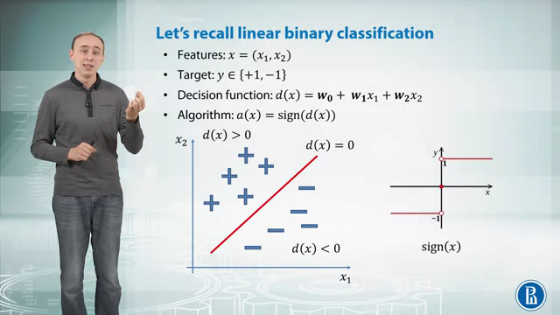
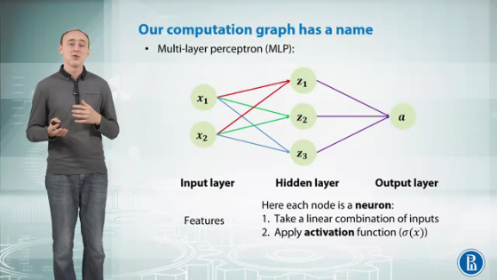
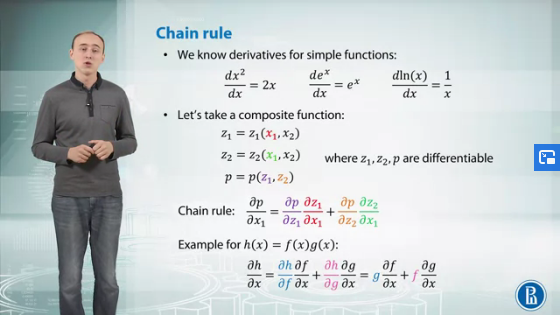
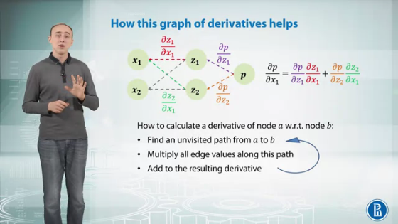
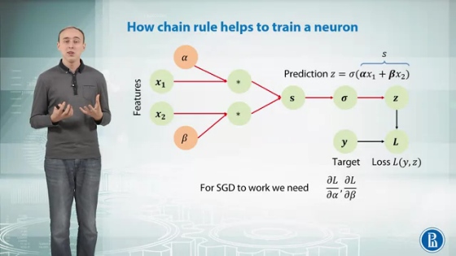
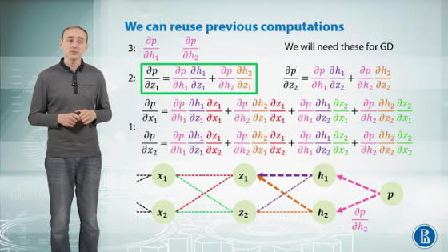
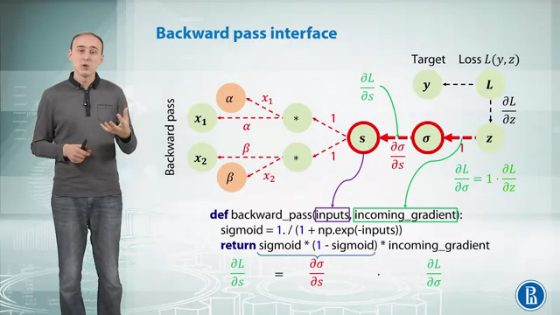
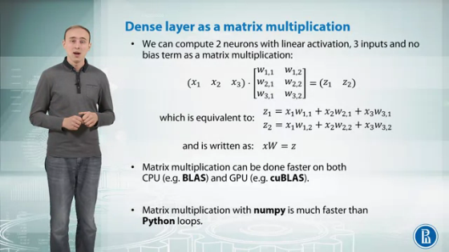
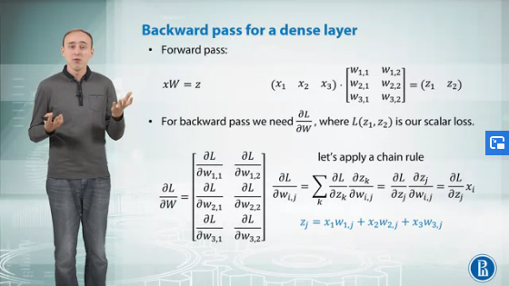
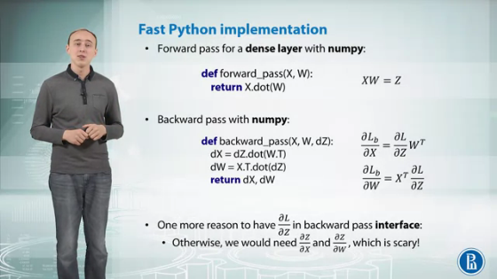

# Introduction to Deep Learning

- [Introduction to Deep Learning](#introduction-to-deep-learning)
  - [Multilayer perceptron (MLP)](#multilayer-perceptron-mlp)
    - [Chain Rule](#chain-rule)
    - [Backpropagation](#backpropagation)
  - [Matrix Derivatives](#matrix-derivatives)
    

---

## Multilayer perceptron (MLP)

The following slide summarises the linear binary classifier.

Another similar task algorithm is Logistic Regression. We can think of it like calculating the distance of a point from the decision function. We convert that distance into probabilities in the range [0,1] using a Sigmoid function. 

This is a basic neural network consisting of multiple neurons.

### Chain Rule

We can use chain rule to compute derivates of composite functions. We can use a computation graph of derivates to compute them automatically.

A really intuitive way to visualize a derivatives graph: 

### Backpropagation

This is called reverse-mode differentiation.
In application to neural networks it has one more name: back-propagation. It works fast, because we reuse computations from previous steps. 

---

## Matrix Derivatives

