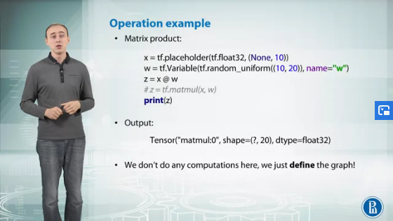
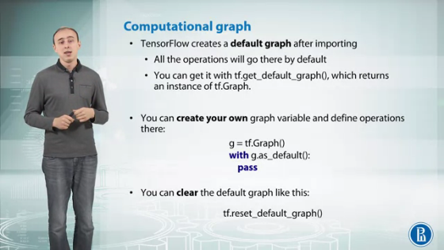
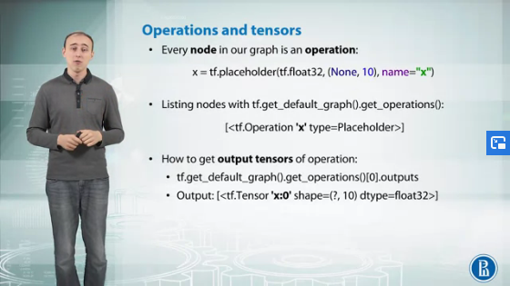
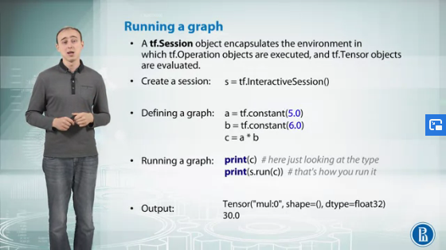
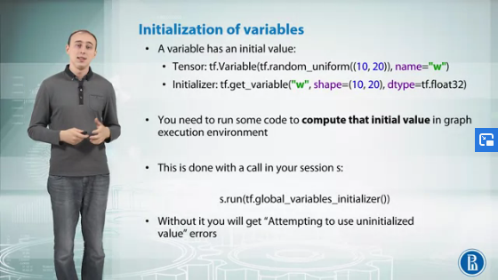
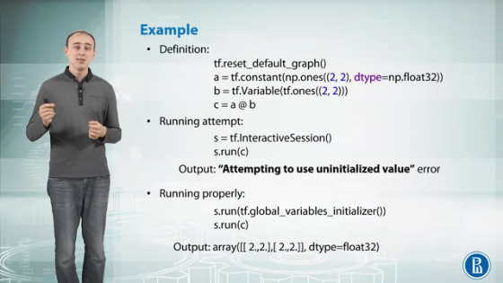
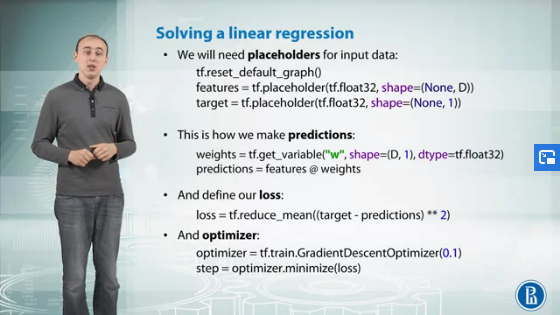

# Introduction to Deep Learning

- [Introduction to Deep Learning](#introduction-to-deep-learning)
  - [Multilayer perceptron (MLP)](#multilayer-perceptron-mlp)
    - [Chain Rule](#chain-rule)
    - [Backpropagation](#backpropagation)
  - [Matrix Derivatives](#matrix-derivatives)
  - [TensorFlow](#tensorflow)
    

---

## Multilayer perceptron (MLP)

The following slide summarises the linear binary classifier.


Another similar task algorithm is Logistic Regression. We can think of it like calculating the distance of a point from the decision function. We convert that distance into probabilities in the range [0,1] using a Sigmoid function. 


This is a basic neural network consisting of multiple neurons.


### Chain Rule

We can use chain rule to compute derivates of composite functions. We can use a computation graph of derivates to compute them automatically.


A really intuitive way to visualize a derivatives graph: 


### Backpropagation


This is called reverse-mode differentiation.
In application to neural networks it has one more name: back-propagation. It works fast, because we reuse computations from previous steps. 


---

## Matrix Derivatives


---

## TensorFlow

The most complete and easiest deep learning framework, Tensorflow has APIs in Python, Java, C++ and Go.

It is a tool to describe computational graphs. The foundation of computation in Tensorflow is the **Graph** object. This holds a network of nodes, each representing one operation, connected to each other as inputs and outputs

It is also a runtime for execution of these graphs.

How the input looks like:
* **Placeholder:** A placeholder is just a place for a tensor, which will be fed during graph execution
  * ``` x = tf.placeholder(tf.float32,(None, 10)) ```

* **Variable:** This is a tensor with some value that is updated during execution
  * ``` w = tf.get_variable("w",shape=(10,20), dtype=tf.float32)```
  * ``` w = tf.Variable(tf.random_uniform((10,20)), name="w")```
* **Constant:** This is a tensor with a value that cannot be changed
  * ``` c = tf.constant(np.ones((4,4)))```



Why do we need a session object?

Operations are written in C++ and executed on CPU or GPU. 
```tf.Session``` owns necessary resources to execute your graph, such as ```tf.Variable``` that occupy RAM. It is important to release these resources when they are no longer required with ```tf.Session.close()```.



Here, we will get an error *attempting to use uninitialized value.* This happens because we used variable b, and in that environment, our variable b is non-existent. We need to initialize it, and to do that, we need to run in our session
the operation ```global_variables_initializer()``` and then run the operation. 



